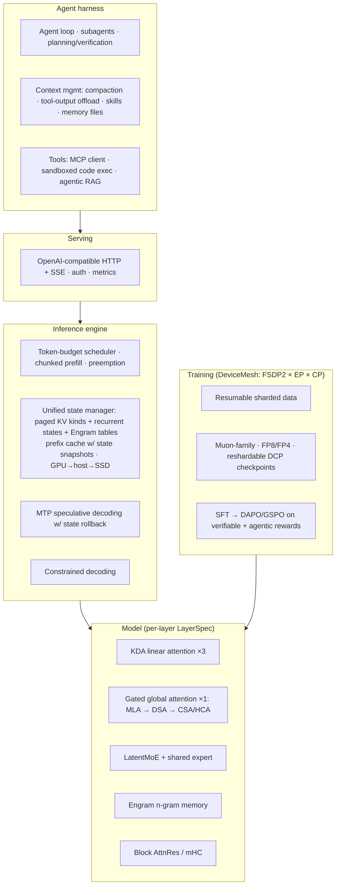

# Goal Architecture

**Status: Agreed** (2026-09-26). All decisions G1–G16 in §10 were accepted. They're recorded in `docs/LLM_SYSTEM_HANDOFF.md` as D9 and D10. This is the target the project works towards. Changes to it go through the handoff doc: a new decision marks the old one **Superseded**.

**History.** v1 was DeepSeek-only. v2 was checked against every major open frontier architecture released through September 2026 (§2). It added:
- linear-attention hybrid layers
- gated attention
- a pluggable residual
- LatentMoE
- Engram
- shared-weight MTP
- NoPE global layers
- modern RL and a full agent harness
- multi-GPU scaling

The final version adds two rules:
- the **extensibility contract** (§4): code for earlier phases is never rewritten to integrate later ones
- the **hardware-independent target** (principle 6): the architecture is never shaped by the developer's own GPU

---

## 0. The short version

The target is a **hybrid linear/global-attention MoE model**, served by **our own inference engine** behind an **OpenAI-compatible API**, with a modern **agent harness** on top: tools, agentic RAG, context management and sandboxed code execution. The same code runs on one local GPU or on rented multi-GPU nodes.

**Repeating layer unit (3:1):**

```
[ KDA ]──[ KDA ]──[ KDA ]──[ Global attention (gated) ]   × N
   linear, O(1) state          DeepSeek lineage: MLA → DSA → CSA/HCA
```

Around that unit:
- **LatentMoE** FFNs with a shared expert and hash-routed early layers
- **Engram** n-gram memory at an early layer
- **Block Attention Residuals** (with mHC as the ablation)
- **shared-weight recursive MTP**, which is also the speculative draft
- NoPE on global layers
- the **Muon** family of optimizers
- a precision path from BF16 to FP8 to FP4



---

## 1. Baseline: what exists today (as of `57c2c22`)

- Packed varlen decoder LM with GQA, RoPE, RMSNorm, and a top-k MoE (softmax router, aux-free bias plus aux loss). Custom Triton flash-attention, grouped SwiGLU MoE kernels, and Muon kernels. (D1–D4)
- Inference: paged KV cache, a single `KVCacheManager`, continuous batching with FIFO full-lifetime reservation, and a split-K paged decode kernel. (D5–D7)
- In progress: FP8 KV quantization (D8). The tree is currently broken there.

---

## 2. Landscape check: where the frontier actually is (September 2026)

There is no single "most modern architecture". The top labs disagree on attention and on residuals. What *is* shared is a set of consensus trends, and this architecture adopts all of them. At each contested point it picks one option and keeps the others pluggable.

| Component | DeepSeek V4 / V4.1 | Kimi K3 (Jul '26) | Qwen3.8-Flash-Next = Qwen4 preview (Aug '26) | Nemotron 3 | MiniMax M3 | **Our choice** |
|---|---|---|---|---|---|---|
| Sequence mixing | CSA/HCA + SWA, no linear layers | **KDA** linear + Gated MLA hybrid | **Gated DeltaNet 3:1** + Qwen Sparse Attention | Mamba-2 + attention anchors | MSA block-sparse | **KDA 3:1 + DeepSeek-lineage global** |
| Attention gating | — | Gated MLA | gated (earlier Qwen3.5) | — | — | **output gate on all softmax layers** |
| Residual | mHC | **Attention Residuals** | gated residuals | standard | — | **pluggable; Block AttnRes default, mHC ablation** |
| Position | partial RoPE | **NoPE** | RoPE | — | — | **NoPE on global layers** (KDA carries order) |
| MoE | shared + routed, sqrt-softplus, hash-routed early layers | Stable **LatentMoE**, 16/896, quantile balancing | 6B active / 125B | **LatentMoE** 22/512 | — | **LatentMoE + shared + sqrt-softplus + hash-early** |
| Lookup memory | Engram (paper) | — | **51B n-gram embeddings at layer 2** | — | — | **Engram at an early layer** |
| MTP | MTP | — | multi-step MTP | **shared-weight, recursive** | — | **shared-weight recursive MTP** |
| Optimizer | Muon | **Per-Head Muon** | — | — | — | **Muon + per-head + QK-clip; distributed Dion3-style** |
| Precision | FP4 QAT experts; FP4 KV (V4.1) | MXFP4 QAT from SFT | — | **NVFP4 pretraining** | — | **BF16 → FP8 → FP4 (dispatch-selected)** |
| Modality | native multimodal (V4.1) | native vision | multimodal line | — | native multimodal | **interface reserved; Phase 8** |

**What is deliberately *not* adopted, and why:**
- **Diffusion LMs as the main model.** Mercury 2, Gemma Diffusion and Nemotron Diffusion are now production-grade and fast. But every frontier *agentic* model above is autoregressive, and our whole engine is built for autoregressive decoding (KV and state caches, tool loops, RL). Block diffusion shows up here as a **DFlash-style speculative drafter** instead (Phase 8).
- **Titans / test-time-training memory.** Still research-stage. None of the open frontier models above ships it.
- **Looped or shared depth** (for example Nanbeige 4.2). This is a small-model parameter-saving trick, not a frontier trend.

---

## 3. Guiding principles

1. **Reference first.** Every fused or Triton kernel has a slow PyTorch reference, and a test compares the two. This is already the repo's practice.
2. **Heterogeneous by design.** Each layer's mixer, FFN, residual and cache kind are declared as a `LayerSpec`. Contested choices (residual type, global-attention type, position encoding) are config switches, so they can be ablated rather than argued about.
3. **The engine/API boundary is the seam.** The agent harness, RAG and evals talk only to the OpenAI-compatible API, so they can be built against any model.
4. **Scale-agnostic code.** Every training component takes a `DeviceMesh` from the start. One GPU is simply a mesh of size 1 (§6.2).
5. **Durable abstractions before fast paths.** The state manager covers KV, recurrent and lookup state from the start.
6. **The target doesn't depend on hardware.** The architecture is chosen for what is modern and instructive, never for what fits a particular development GPU. Hardware only decides which *config size* and which *kernel implementation* runs on a given machine. It never decides which components exist. Any precision or kernel the machine can't run natively falls back to its reference or emulated path, and the model definition stays the same.
7. **Extend, never rewrite.** See §4. Every later phase plugs into interfaces that exist from Phase 0.

---

## 4. Extensibility contract: extend, never rewrite

**Goal:** each phase *adds* files, registry entries and config values. It never rewrites code from an earlier phase to make room. The interfaces below are created in Phase 0, and the current GQA/MoE code becomes their first implementation, with behavior unchanged. After that, GDN, KDA, MLA, DSA, CSA/HCA, LatentMoE, Engram, MTP, AttnRes/mHC and the distributed code all plug in rather than getting woven in.

### 4.1 Rules

1. **Code against interfaces, not concrete classes.** These `Protocol`s are defined once:

   | Interface | Contract | First impl |
   |---|---|---|
   | `SequenceMixer` | `forward(x [T,D], meta: BatchMeta, state: LayerStateView \| None) -> [T,D]`; `state_specs(cfg) -> list[StateSpec]`; `capabilities: MixerCaps` | GQA |
   | `FeedForward` | `forward(x [T,D], meta) -> (y [T,D], AuxOutputs)` | current MoE |
   | `Residual` | `init(x0) -> RState`; `read(RState, i) -> x_in [T,D]`; `write(RState, i, y) -> RState`; `final(RState) -> [T,D]` | standard residual |
   | `TokenMemory` | `forward(x [T,D], meta) -> x` (reads `meta.token_ids`) | none (identity) |
   | `OutputHead` | `forward(h, meta) -> (logits, AuxOutputs)` | LM head (MTP added later) |

   `MixerCaps` has these flags, so the engine and scheduler never special-case a mixer type:

   | Flag | Meaning |
   |---|---|
   | `chunked_prefill` | can prefill in chunks |
   | `prefix_snapshot` | supports prefix-cache snapshots |
   | `rollback` | can roll back state (speculative decoding) |
   | `context_parallel` | supports context parallelism |
   | `needs_positions` | reads position indices |

2. **One batch-metadata object instead of growing argument lists.** `BatchMeta` is a frozen dataclass holding:
   - `token_ids`, `positions`, `cu_seqlens`, `max_seqlen`
   - `mode` (`train | prefill | decode | verify`)
   - `slot_ids`, `mesh`, and so on

   New needs become **new fields with defaults**, so existing modules never change signature. (Today `Attention.forward` takes 8 positional parameters, and every new feature would add more.)

3. **Modules never own or allocate cache or state.** Mixers declare `StateSpec`s, and the engine allocates. A mixer only sees a `LayerStateView` offering `read/append/update`. The manager API has its full shape from day one:

   `reserve / commit / truncate / snapshot / restore / free`

   That holds even while the first implementations of `truncate` and `snapshot` are trivial. Speculative decoding and prefix caching then need no API change.

4. **Registries plus config-driven construction.** Components are registered by name, for example `MIXERS["kda"] = KDA`, `FFNS["latent_moe"] = LatentMoE`, `RESIDUALS["block_attnres"] = ...`. The model builder reads `ModelConfig.layers: list[LayerSpec]` (produced by a pattern helper such as `hybrid(unit=["kda"]*3 + ["global"], n=4)`) and never imports concrete classes. **Adding a component means a new file, one registry line, and a config value.**

5. **Auxiliary outputs form an open channel.** `AuxOutputs(losses: dict[str, Tensor], metrics: dict[str, Any])` flows up from every module. The trainer sums losses using weights from config: MoE balance, MTP, indexer KL, and anything added later. (Today `model.py` assumes every block returns MoE stats with `aux_loss`, which breaks as soon as a dense or hash FFN appears.)

6. **Kernel dispatch layer.** Each op (attention variants, delta rule, grouped GEMM, quantize, Newton–Schulz) has:
   - a PyTorch **reference**
   - zero or more fast implementations, selected at runtime by device capability and dtype

   Precision and hardware are decided here and nowhere else (principle 6). Tests run every registered implementation against the reference.

7. **Distributed-ready by construction.** Modules never call `torch.distributed` directly. Parameters carry sharding metadata (for example `expert_dim=0` on expert weights), and FSDP/EP/CP wrapping is a *policy function* applied to the built model over a `DeviceMesh`. Changing the parallelism layout changes that policy, not the modules.

8. **Stable boundaries.** Three seams must stay fixed:
   - **engine ↔ model:** `model(meta, states) -> (logits, aux)`
   - **API ↔ engine:** OpenAI schema
   - **harness ↔ API:** HTTP

   Internal refactors can't leak across a seam.

9. **Versioned configs and checkpoints.**
   - Config dataclasses serialize to JSON with a `schema_version`, and unknown fields fail loudly.
   - Checkpoints embed their config.
   - Loaders migrate old versions forward, so an old checkpoint keeps loading after the model grows new optional components.

10. **Contract tests per interface.** One generic suite is parametrized over each registry. Every mixer automatically gets these checks:
    - shape
    - **varlen boundary isolation** (no information leaks across `cu_seqlens`)
    - prefill + decode equals full recompute
    - chunked equals unchunked
    - rollback and snapshot round-trips, when its caps claim them
    - dtype and determinism

    FFNs and residuals get the equivalent checks. A new component is "done" when it passes the generic suite plus its own specific tests.

### 4.2 Current couplings the Phase 0 refactor removes

| Where | Coupling today | Becomes |
|---|---|---|
| `model/attention.py` | branches on `mode`, calls `paged_kv_cache.append_kv` and the decode kernel directly | GQA `SequenceMixer`; cache access via `LayerStateView`; kernels via dispatch |
| `model/decoder_block.py` | hardwires `Attention` + `MoE` + plain residual | generic block: `Residual.read → mixer → Residual.write → ffn`, all from registries |
| `model/model.py` | assumes every block returns MoE stats with `aux_loss`; loops with a per-layer cache list | collects `AuxOutputs`; passes `BatchMeta` and state views |
| `model/model_config.py` | flat, uniform-layer fields | global fields + `layers: list[LayerSpec]` + `schema_version` |
| `inference/cache_manager.py` | single KV kind | `StateManager` over `StateSpec` pools with the full API from rule 3 |
| `inference/paged_kv_cache.py` | one storage class, K/V layout baked in | one storage class per `StateSpec` kind |
| training entry points | single-process assumptions | size-1 `DeviceMesh` + sharding policy hook |

**Refactor exit test:** the whole existing suite passes unchanged, and greedy generation from the current checkpoint is token-identical before and after the refactor.

---

## 5. Target model

### 5.1 `LayerSpec`

- Structure: `LayerSpec(mixer: MixerSpec, ffn: FFNSpec)`, plus a global `ResidualSpec`.
  - `MixerSpec` is one of `GQA | MLA | DSA | CSA(m, k_sel, n_win) | HCA(m, n_win) | GDN | KDA`.
  - `FFNSpec` is one of `Dense | MoE | LatentMoE | HashMoE`.
- **Invariant:** each mixer exposes `state_specs() -> list[StateSpec]` (§7.1). The engine never inspects mixer internals.
- **Default stack for a 16-layer model:**
  - units of `[KDA, KDA, KDA, Global]`, with Global alternating CSA and HCA once Phase 5 lands (MLA/DSA before that)
  - `HashMoE` in layer 0
  - Engram after layer 1

### 5.2 Linear attention: Gated DeltaNet → KDA

This is the most important addition. Three of every four layers carry a **fixed-size recurrent state** instead of a growing KV cache.

- **Inputs:** `q, k: [T, H, d_k]` and `v: [T, H, d_v]`, after a short causal depthwise conv (kernel 4) and L2-normalization of q and k. Per-token `β_t ∈ (0,1)` and a decay gate.
- **GDN (implemented first):** scalar decay per head.
  - `S_t = α_t (I − β_t k_t k_tᵀ) S_{t−1} + β_t k_t v_tᵀ`
  - `o_t = S_tᵀ q_t`
  - State `S: [H, d_k, d_v]` per request.
- **KDA (target):** the same delta rule with **channel-wise** decay `Diag(a_t)` over `d_k`. It's finer-grained forgetting, and Kimi reports that it outperforms GDN.
- **Output:** RMSNorm plus a sigmoid output gate, then `o_proj`.
- **Kernels:** the recurrent form is the reference (and is the decode path). The chunkwise-parallel form (WY/UT transform, chunk size 64) is the training and prefill path.
- **Invariants:**
  - chunkwise output equals recurrent output
  - **state resets at every `cu_seqlens` boundary** (packed varlen, D1)
  - prefill-then-decode equals a full recompute

### 5.3 Global attention: the DeepSeek lineage

These layers make up 1 in 4 of the stack. Each step builds on the previous one:

1. **MLA** (latent KV `[d_c + d_rope]` per token, absorbed decode).
   - ⚠ Needs the flash kernel generalized to `D_qk ≠ D_v`.
2. **DSA** (lightning indexer plus top-k). **Invariant:** `k_sel ≥ len` gives exactly dense MLA.
3. **CSA/HCA** (sequence-compressed entries at m=4 and m=128, plus an SWA branch and a sink).
   - **Visibility invariant:** every past token is visible through a completed compressed entry or the window, so `n_win ≥ m_max`. Tokens in a partial group live in a tail state.
4. **Stretch:** V4.1-Flash CSA2 cross-layer index reuse and FP4 KV.

Also on every global layer:
- **Output gating** on every softmax-attention layer: `o = softmax_attn(...) ⊙ σ(x W_g)`. It's cheap, and it removes the attention-sink and massive-activation pathologies.
- **NoPE by default.** In a hybrid stack the KDA layers carry position, so global layers can drop RoPE (Kimi's choice). That also removes the YaRN context-extension step. Keep partial RoPE as a config switch for ablation.

### 5.4 Residual: pluggable, with Block AttnRes as default

- `ResidualSpec = Standard | BlockAttnRes(num_blocks≈8) | mHC(n=4)`.
- **Block AttnRes (Kimi):**
  - Layers are grouped into blocks.
  - Each layer's input is a softmax-weighted mix over the embedding, the completed block representations and the current partial block, using a learned per-layer query.
  - Memory is O(blocks × d). Kimi reports about 1.25× compute efficiency, under 4% training overhead and under 2% inference overhead.
- **mHC (DeepSeek):** n residual streams mixed by a doubly-stochastic (Sinkhorn) matrix. Memory is n× the residual.
- **Why AttnRes is the default:** it's the newer result, it's cheaper in memory (which matters on rented GPUs), and it's used by the newest frontier model (K3). mHC is implemented as the comparison. **Decision rule:** keep whichever wins the Phase 1 ablation at equal compute.
- **Invariant:** both reduce to the standard residual in their degenerate configuration, and tests check that.

### 5.5 LatentMoE v2 (evolves D3)

- **LatentMoE:** tokens are projected `d → ℓ` (for example `ℓ = d/4`) before routed experts and back afterwards. At the same cost you can scale up both expert count and top-k by `d/ℓ`.
  - **All-to-all traffic under expert parallelism also shrinks by `d/ℓ`.** That's the key reason to choose it when you plan to rent multiple GPUs.
- **Shared expert:** full-width SwiGLU, always active.
- **Scoring:** `sqrt(softplus(logits))` with normalized top-k gates. Load balancing uses the existing aux-free bias, and K3's **quantile balancing** is an ablation. Add a tiny sequence-wise loss.
- **Hash-routed MoE** in the first layer(s).
- The existing grouped kernels carry over unchanged; they just run at width ℓ.

### 5.6 Engram n-gram memory

- Hashed 2- and 3-gram embedding tables with multi-head hashing, a context-aware gate on the hidden state, and a residual add at an early layer.
- **Why it's now core:** DeepSeek published it, and the Qwen4 preview ships 51B n-gram parameters at layer 2.
- Lookups depend only on token IDs, so tables can live in host memory with prefetch. The engine treats them as a read-only state kind.

### 5.7 Shared-weight recursive MTP

- One MTP block (sharing the embedding and LM head) is trained at several offsets and applied recursively at inference to draft k tokens (Nemotron 3 reports an average acceptance length of 3.45).
- **Packing invariant:** MTP targets never cross a `cu_seqlens` boundary.

### 5.8 Precision

- **Path:** BF16, then FP8 blockwise, then FP4 (NVFP4 or MXFP4).
  - Each is a kernel-level choice behind the dispatch layer (§4, rule 6), with BF16 as the reference.
  - Hardware without native support runs emulated (fake-quant) paths. The model structure is the same in every case.
  - FP4 QAT for experts from the start of SFT (following V4 and K3).
- Keep attention, latent projections, embeddings and the last ~15% of layers in BF16. That's Nemotron's recipe.

### 5.9 Multimodal (reserved)

- The token stream and chat template reserve image placeholder IDs, and `embed()` accepts pre-computed patch embeddings.
- Native vision is Phase 8.

---

## 6. Training system

### 6.1 Core

- **Data:** deterministic, sharded, resumable streaming from pre-tokenized shards, with document packing (done).
- **Tokenizer:** retrain the HF BPE at 64k vocab with reserved special tokens: roles, `<think>`, tool-call and tool-result tokens, image placeholders, and spares.
- **Optimizer:** Muon for matrices (with **per-head Muon** for attention projections and **QK-clip** for logit stability), and AdamW for embeddings, norms, gates, biases and Engram tables.
- **Post-training:**
  - SFT, then **DAPO** (dense layers) or **GSPO** (sequence-level; more stable for MoE), on verifiable rewards (math answers, unit tests, schema-valid tool calls).
  - Then **agentic RL in sandboxes**, with multi-turn rollouts and outcome rewards.
  - Optionally, domain-expert RL runs merged via on-policy distillation (V4's recipe).

### 6.2 Multi-GPU scaling

- **One `DeviceMesh`, four dimensions:** `dp_replicate × dp_shard × ep × cp`. A local GPU is `1×1×1×1`. Tensor and pipeline parallelism are deferred because they aren't needed below roughly 30B total parameters. torchtitan is the reference design.
  - **FSDP2** (`fully_shard`) for parameters, gradients and optimizer state.
  - **Expert parallelism:** experts are sharded over `ep`, with all-to-all dispatch and combine around the existing grouped kernels. LatentMoE cuts that traffic by `d/ℓ`.
  - **Context parallelism** for long sequences:
    - Global layers all-gather KV. Compressed CSA/HCA KV makes that cheap.
    - KDA layers pass chunk states rank to rank.
- **Distributed Muon:** orthogonalization needs whole matrices. Each matrix gets an owning rank that gathers, orthogonalizes and scatters. Upgrade to Dion3-style megabatching (one collective per weight shape) and Gram Newton–Schulz.
- **Rental-proof checkpoints:**
  - async **DCP** saves that **reshard** (save on 8 GPUs, resume on 4 or 16)
  - data-loader state included
  - a checkpoint every N minutes so a preempted spot instance loses little work
- **Testing:** all mesh logic runs under multi-process CPU/gloo tests, then a 2-GPU rented smoke test, before any expensive run.
- **Scale tiers** (same code, different configs):

  | Tier | Hardware | Model (total / active) | Tokens | Purpose |
  |---|---|---|---|---|
  | S | local dev GPU | ~0.1–0.5B / ~50–150M | 1–10B | development, ablations |
  | M | 1 rented 8×H100/H200/B200 node | ~3–8B / ~0.5–1B | 50–200B | first real model |
  | L | multi-node | as budget allows | — | code supports it; the budget decides |

- **Cost estimate:**

  `hours ≈ 6 · N_active · tokens / (GPUs · peak_FLOPs · MFU · 3600)`

  Example: 1B active parameters, 100B tokens, 8×H100 (about 989 dense BF16 TFLOPs each) at 35% MFU comes to roughly 60 hours, about **$1.2–1.7k** at $2.5–3.5 per GPU-hour. That's optimistic; custom MoE and hybrid kernels usually get lower MFU.

---

## 7. Inference engine (evolves D5–D8)

### 7.1 Unified state manager

This generalizes `KVCacheManager` into one owner for every per-request state kind:

| `StateSpec` | Shape | Paging |
|---|---|---|
| `FullKV` | `[H_kv, 2, D]` / token | paged |
| `LatentKV` | `[d_c + d_rope]` / token | paged |
| `IndexerKey` | `[d_I]` / token or entry | paged |
| `CompressedKV(m)` | 1 entry / m tokens | paged |
| `SlidingWindow(n)`, `TailState` | fixed size / request | slot |
| `RecurrentState` (KDA) | `[H, d_k, d_v]` + conv state `[H·d, 3]` / request | slot |
| `EngramTable` | shared, read-only | host-resident + prefetch |

Invariants and ownership:
- Page size in tokens is a multiple of the largest compression ratio *and* of the KDA chunk size.
- Ownership stays as in D5: the manager is CPU-authoritative with a device mirror, and storage only validates.

### 7.2 Prefix caching

- Chained block hashes, ref-counted pages, and LRU eviction across GPU, pinned host memory and SSD tiers.
- **Recurrent layers can't be sliced by prefix.** So the engine stores **state snapshots at page boundaries** for cached prefixes, the approach Kimi contributed to vLLM for KDA.
- **Invariant:** resuming from a snapshot gives the same result as a full prefill.

### 7.3 Scheduler and decoding

- A token-budget scheduler that mixes chunked prefill with decode, with incremental page growth and **preemption**. It replaces D6's full-lifetime reservation.
- **Speculative decoding** with recursive MTP drafts and rejection-sampling verification.
  - Rejecting a draft means **rolling back recurrent state**: keep per-draft-position states, or recompute from the last accepted state.
  - **Invariant:** greedy speculative output equals greedy non-speculative output.
- **Constrained decoding:** a per-request token mask driven by a JSON-schema automaton. Build a minimal one first, then allow swapping in XGrammar or llguidance.
- **Engine plumbing:** CUDA graphs for decode, and weight quantization for serving (FP8/FP4).
- **Sparse-attention kernels:** use MiniMax's "KV-outer, gather-Q" loop order for block-sparse prefill, so each KV block is read once.

---

## 8. Serving, agent harness, deployment, evaluation

- **Serving:** FastAPI async front end, with the engine loop on its own thread (D6).
  - Endpoints: `/v1/chat/completions` (SSE, `tools`, `response_format`), `/v1/models`, `/health`, `/metrics`.
  - Auth and rate limiting.
- **Agent harness.** The 2026 view is that the model supplies the intelligence and the harness makes it useful.
  - Chat template with interleaved thinking kept across tool rounds, and a bounded agent loop.
  - **Tools** via an MCP client, plus **sandboxed code execution** (allow-listed, no network by default) as the general-purpose tool.
  - **Context management:** compaction when context fills, offloading large tool outputs to files, and **skills** (progressive disclosure, so not every tool schema sits in context).
  - **Memory:** persistent memory files injected at start.
  - **Subagents** with isolated contexts for parallel subtasks, and planning plus self-verification loops.
- **Agentic RAG:**
  - Retrieval is a tool the model decides to call, and RL can later train when and how to search.
  - Search: hybrid BM25 + dense + **late-interaction (ColBERT-style multi-vector)** retrieval, with contextual chunk headers and a cross-encoder reranker.
  - If retrieval comes back weak, it falls back to broader search. Answers cite sources.
  - Stable documents go first so prefix caching reuses their state.
  - Treat retrieved text as untrusted: defend against prompt injection and poisoned documents.
- **Deployment:** Docker (CUDA base, `uv`-locked), safetensors, and versioned configs and chat templates. Start on a single cloud GPU; disaggregated prefill/decode comes later. CPU CI on GitHub Actions.
- **Evaluation** (built alongside, not at the end):
  - **Model:** loss, small benchmarks, needle-in-haystack and RULER-style long-context probes, and MoE load stats.
  - **Engine:** TTFT, TPOT, memory and state bytes per token, prefix-hit rate, spec acceptance.
  - **Agent:** tool-call validity, task success, RAG recall@k and citation precision.

---

## 9. Roadmap

Each phase has exit criteria.

**Phase 0: Stabilize and lay the extension points**
- **0a.** Finish D8 FP8 KV and fix the broken imports and tests. Add CPU CI.
  - *Exit:* all tests green, and FP8 decode matches BF16 within tolerance.
- **0b. Extensibility refactor (§4), behavior-preserving.**
  - `BatchMeta`, the `SequenceMixer`/`FeedForward`/`Residual`/`TokenMemory`/`OutputHead` protocols, registries, `LayerSpec` config with `schema_version`, and `AuxOutputs`.
  - A `StateManager` with the full `reserve/commit/truncate/snapshot/restore/free` API, where GQA KV is the first `StateSpec`.
  - The kernel dispatch layer, the size-1 `DeviceMesh` plus sharding-policy hook, and the generic contract-test suites.
  - *Exit:* the existing suite passes unchanged, and greedy generation is token-identical before and after.

**Phase 1: Model core I**
- QK-norm, gated attention, **MLA**, **LatentMoE**, **Block AttnRes** and **mHC**. Each is added as a registered component; nothing from Phase 0 is rewritten.
- Tier-S ablations: each feature against the current baseline, and AttnRes against mHC.
- *Exit:* reference-vs-kernel tests pass, and there's an ablation table.

**Phase 2: Model core II (hybrid)**
- **GDN, then KDA** (recurrent reference, then chunkwise Triton kernel, with varlen state resets). The 3:1 hybrid stack with NoPE on global layers.
- **Engram.**
- *Exit:* chunkwise equals recurrent; the hybrid beats the all-global baseline at equal compute.

**Phase 3: Training system and scale-out**
- Retrained tokenizer and shared-weight MTP.
- **FSDP2 + EP + CP on the mesh**, distributed Muon, reshardable async DCP.
- FP8, and the eval harness.
- A 2-GPU rented smoke test, then the **first Tier-M run**.
- *Exit:* resume works on a different GPU count, and the model is trained with dashboards.

**Phase 4: Engine II**
- Unified state manager (KV, recurrent and Engram kinds), prefix caching with state snapshots, token-budget scheduler with preemption, MTP speculative decoding with state rollback, and CUDA graphs.
- *Exit:* greedy speculative output equals greedy non-speculative output, and snapshot resume equals full prefill under a random-workload stress test.

**Phase 5: Long-context global attention**
- **DSA, then CSA/HCA** for the global layers, FP4 KV, and context extension to 128k or more.
- Stretch: CSA2.
- *Exit:* dense-equivalence and visibility tests pass, and state bytes per token and FLOPs are measured.

**Phase 6: Post-training and agent harness**
- SFT, DAPO/GSPO with verifiable rewards, and sandboxed agentic RL.
- Constrained decoding, the harness (MCP, code exec, compaction, skills, memory, subagents), and agentic RAG.
- *Exit:* ≥99% schema-valid tool calls, and reported task success and RAG recall.

**Phase 7: Serving and deployment**
- API, Docker, cloud deploy, host/SSD tiers, observability.
- *Exit:* a public HTTPS endpoint and a load-test report.

**Phase 8: Frontier stretch**
- Native vision, a DFlash-style block-diffusion drafter, NVFP4 pretraining at scale, disaggregated serving, and V4.1's causal encoder–decoder split.

---

## 10. Decisions (all Agreed 2026-09-26)

| ID | Decision |
|---|---|
| G1 | Hybrid stack: KDA linear layers, 3:1 with gated global attention; global follows DeepSeek MLA → DSA → CSA/HCA |
| G2 | `LayerSpec` / `StateSpec` / `ResidualSpec` as the organizing abstractions |
| G3 | Residual pluggable: Block AttnRes default, mHC ablation; keep the winner |
| G4 | LatentMoE + shared expert + sqrt-softplus + hash-routed early layers |
| G5 | Engram n-gram memory as a core feature |
| G6 | Shared-weight recursive MTP, reused as the speculative draft |
| G7 | NoPE on global layers by default (RoPE as ablation) |
| G8 | Muon family: per-head Muon, QK-clip, distributed Dion3-style implementation |
| G9 | DeviceMesh from Phase 0; FSDP2 + EP + CP; reshardable DCP; scale tiers S/M/L |
| G10 | Unified state manager (KV + recurrent + lookup), prefix cache with state snapshots, preemptive token-budget scheduler |
| G11 | Precision: BF16 → FP8 → FP4 as dispatch-layer kernel choices with emulated fallbacks; FP4 QAT from SFT |
| G12 | Post-training: DAPO/GSPO on verifiable rewards, then sandboxed agentic RL |
| G13 | Agent harness (MCP, sandbox code exec, compaction, skills, memory, subagents) + agentic hybrid/late-interaction RAG behind an OpenAI-compatible API |
| G14 | Roadmap Phases 0–8 as in §9; autoregressive (not diffusion) main model |
| G15 | Extensibility contract (§4): interfaces, `BatchMeta`, registries, engine-owned state, open `AuxOutputs`, kernel dispatch, sharding policies, stable seams, versioned configs, generic contract tests; built in Phase 0b |
| G16 | Hardware-independent target: development hardware never shapes the architecture, only config size and kernel choice |

## 11. Open questions (non-blocking)

1. **Rough rental budget per training run.** Only sets the Tier-M config size; the architecture is the same either way. Needed before Phase 3.
2. **Deployment audience:** just you, a small group, or public. Sets auth, cost ceiling and cloud choice. Needed before Phase 7.

---

## Sources

- DeepSeek-V4: https://arxiv.org/html/2606.19348v1
- DeepSeek-V4.1-Flash: https://arxiv.org/abs/2609.19969
- Kimi K3 paper: https://arxiv.org/abs/2607.24653
- Kimi K3 tech blog: https://www.kimi.ai/blog/kimi-k3
- Raschka, K3 architecture notes: https://sebastianraschka.com/blog/2026/kimi-k3-architecture-notes.html
- Attention Residuals: https://huggingface.co/papers/2603.15031
- Qwen3.8-Flash-Next (Qwen4 preview): https://www.unite.ai/qwen3-8-flash-next-previews-qwen4-architecture-with-6b-active-parameters/
- Qwen3.5 and the attention landscape: https://huggingface.co/blog/mlabonne/qwen35
- Nemotron 3 Super (LatentMoE, shared MTP, NVFP4): https://arxiv.org/abs/2604.12374
- MiniMax M3 (MSA): https://www.minimax.io/blog/minimax-m3
- Raschka, LLM Architecture Gallery: https://sebastianraschka.com/llm-architecture-gallery/
- Raschka, open-weight notes (Jul 2026): https://sebastianraschka.com/blog/2026/notable-open-weight-models-this-week.html
- mHC: https://arxiv.org/abs/2512.24880
- Engram: https://arxiv.org/abs/2601.07372
- Dion3: https://arxiv.org/pdf/2608.11612
- Speculative decoding in 2026 (EAGLE-3 / DFlash): https://dev.to/monuminu/speculative-decoding-in-2026-from-eagle-to-dflash-to-xpress-the-complete-engineers-playbook-3ald
- Agentic RL in 2026: https://huggingface.co/blog/sergiopaniego/agentic-rl-2026
- Diffusion LM status: https://kuleshov-group.github.io/blog/blog/2026/how-to-build-a-diffusion-language-model/
- Agent harness anatomy: https://www.langchain.com/blog/the-anatomy-of-an-agent-harness
- RAG state of the art: https://techwithcolonel.com/artifact/rag-state-of-the-art-2026.html
- DeepSeek-V2 (MLA): https://arxiv.org/abs/2405.04434 · DeepSeek-V3 (MTP, FP8, aux-free): https://arxiv.org/abs/2412.19437
