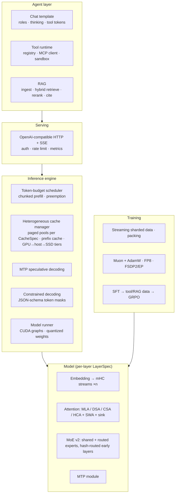

# Goal Architecture Proposal

**Status: Proposed** (2026-09-26). Nothing here is agreed yet. When you accept an item (by its `G#` ID in §7), it moves into `docs/LLM_SYSTEM_HANDOFF.md` as **Agreed**. Everything below is Claude's recommendation. Where there's a real alternative, the doc names it and says what it would cost.

---

## 0. The short version

The target is a **DeepSeek-V4-style long-context MoE model** served by **our own inference engine** behind an **OpenAI-compatible API**, with a **tool-use and RAG agent layer** on top, packaged for deployment on a single cloud GPU.

The model follows DeepSeek's own lineage, and each step builds on the previous one:

```
GQA (today) ──► MLA (latent KV) ──► DSA (lightning indexer + top-k sparse)
            ──► CSA / HCA hybrid (sequence-compressed KV + sliding window + sink)
            ──► CSA2-style cross-layer index reuse and FP4 KV (DeepSeek-V4.1-Flash, Sept 2026)
```

Around that: **mHC** residual streams, **DeepSeekMoE v2** (shared expert, sqrt-softplus scoring, hash-routed early layers), **MTP** heads (which also serve as the speculative-decoding draft), Muon (already implemented), and FP8 and later FP4 precision.



---

## 1. Baseline: what exists today (as of `57c2c22`)

- Packed varlen decoder LM with GQA, RoPE, RMSNorm, and a top-k MoE (softmax router, aux-free bias plus aux loss). Custom Triton flash-attention, grouped SwiGLU MoE kernels, and Muon kernels. (D1–D4)
- Inference: paged KV cache, a single `KVCacheManager`, continuous batching with FIFO full-lifetime reservation, and a split-K paged decode kernel. (D5–D7)
- In progress: FP8 KV quantization (D8). The tree is currently broken there, and three tests fail collection.
- The data pipeline has an HF `tokenizers` byte-level BPE and a streaming dataset. Training targets FineWeb-Edu.

This is a strong base. The engine work in particular (paged cache, ownership split, split-K decode) carries straight into the target.

---

## 2. Guiding principles

1. **Reference first.** Every fused or Triton kernel has a slow PyTorch reference, and a test compares the two. The repo already works this way; the proposal keeps it.
2. **The layer stack is heterogeneous by design.** V4 interleaves attention types by depth, so each layer's attention, FFN and cache kind are declared in config as a `LayerSpec`. Nothing assumes that all layers are the same.
3. **The engine/API boundary is the seam.** Everything above the engine (agent, RAG, tools, evals) talks only to the OpenAI-compatible API. It can therefore be built and tested against any backend, including a stronger open model, while our own model is still small.
4. **Be honest about scale.** On one GPU, the long-context techniques are validated by correctness against dense references plus measured memory and FLOP savings. They are not validated by frontier-quality claims.
5. **Durable abstractions before fast paths.** The cache manager is designed for compressed and sliding-window kinds now, even though GQA and MLA get implemented first. That avoids a second rewrite later.

---

## 3. Target architecture

### 3.1 Model

| Component | Today | Target | Origin |
|---|---|---|---|
| Layer config | one global `ModelConfig` | `ModelConfig.layers: list[LayerSpec]` (attention kind, FFN kind, cache kind) | V4 interleaving |
| Residual | plain pre-norm residual | **mHC**: n=4 residual streams, doubly-stochastic mixing | mHC (Dec 2025), V4 |
| Attention | GQA + RoPE | **MLA** → **DSA** → **CSA/HCA** + SWA branch + attention sink + QK-norm | V2/V3, V3.2, V4, V4.1 |
| Positional | RoPE (full head) | Decoupled/partial RoPE (rope dims kept separate, stored BF16) + YaRN for extension | V2+ |
| FFN | MoE, softmax router | Fine-grained routed + **1 shared expert**, **sqrt(softplus)** scores, normalized top-k gates, aux-free bias + tiny sequence-wise loss, **hash routing** in the first 1–2 layers | V3, V4 |
| Output | LM head (tied) | LM head + **1 MTP module** (shared embedding/head) | V3 |
| Memory | none | **Engram** hashed n-gram lookup memory (experimental tier) | Engram (Jan 2026) |
| Precision | BF16 | BF16 → FP8 blockwise training (GPU permitting) → FP4 QAT for experts | V3, V4 |

#### 3.1.1 `LayerSpec`: the organizing abstraction

- **Purpose:** declare per-layer behavior so the model, cache manager and kernels all read one source of truth.
- **Shape:** `LayerSpec(attn: AttnSpec, ffn: FFNSpec)`. Here `AttnSpec` is one of `GQA | MLA | DSA | CSA(m, k_sel, n_win) | HCA(m, n_win) | SWAOnly(n_win)`, and `FFNSpec` is one of `Dense | MoE | HashMoE`.
- **Invariant:** each `AttnSpec` exposes `cache_specs() -> list[CacheSpec]` (see §3.3.1). The engine never inspects attention internals.
- **Default stack (V4-like, for a 16-layer model):** layers 0–1 HCA with hash-MoE, layers 2–14 alternating CSA/HCA at about 3:1, and layer 15 SWA-only. Tune after the first ablations.

#### 3.1.2 MLA (stepping stone and substrate)

Illustrative small-model dimensions: `d_c=256` (KV latent), `d_cq=384` (Q latent), `d_nope=64`, `d_rope=32`, `d_v=64`, `H` heads.

- `c_kv = RMSNorm(x W_dkv)` → `[T, d_c]`; `k_rope = RoPE(x W_kr)` → `[T, d_rope]`, shared across heads.
- `c_q = RMSNorm(x W_dq)` → `[T, d_cq]`; `q_nope = c_q W_uq` → `[T, H, d_nope]`; `q_rope = RoPE(c_q W_qr)` → `[T, H, d_rope]`.
- **Cached per token:** `[d_c + d_rope]`, one "head" with no `H_kv` dimension. That's about 288 values against GQA's `2·H_kv·D`.
- **Train/prefill (non-absorbed):** `k = [c_kv W_uk ; k_rope]` → `[T, H, d_nope+d_rope]`; `v = c_kv W_uv` → `[T, H, d_v]`.
  - ⚠ The current flash kernel assumes `D_qk == D_v`, so it needs a `D_qk ≠ D_v` generalization.
- **Decode (absorbed):** `q_lat = q_nope · W_ukᵀ` → `[B, H, d_c]`; scores = `q_lat·c_kv + q_rope·k_rope`; `out_lat = softmax · c_kv` → `[B, H, d_c]`; then `W_uv`, then `o_proj`.
  - This is an MQA decode kernel with `D_k = d_c + d_rope` and `D_v = d_c`.
- **Invariant/test:** absorbed and non-absorbed outputs match within tolerance, and prefill-then-decode matches a full recompute.

#### 3.1.3 DSA: lightning indexer and top-k sparse attention (on MLA)

- Indexer: `H_I` small heads (for example 4) with dim `d_I` (for example 64).
  - `I[t,s] = Σ_j w[t,j] · ReLU(q_I[t,j] · k_I[s])`, with `q_I` from `c_q` and `k_I` from `x`, shared.
- Select the top `k_sel` causal positions (at our scale about 256; the paper uses 2048). MLA then attends only over those.
- Cache: extra `IndexerKey` kind `[d_I]` per token, FP8 (FP4 in V4).
- Training: (1) dense warm-up, where only the indexer trains, using KL(main-attention distribution summed over heads ‖ softmax(I)); (2) sparse training of everything.
- **Invariant:** if `k_sel ≥ context length`, the output equals dense MLA exactly. That makes it the core test.

#### 3.1.4 CSA / HCA (the goal attention)

- **CSA (m=4):** compress each window of about 4 tokens (overlapping) into one KV entry using learned, per-dimension, softmax-gated pooling with a positional bias. Entries are shared-KV (MQA-style, MLA-like latent plus BF16 rope part).
  - A lightning indexer over the compressed entries picks the top-k.
  - Attention runs over the selected compressed entries, a **sliding window of recent raw tokens**, and an **attention sink**.
- **HCA (m=128):** the same compression but far more aggressive, with **dense** attention over all compressed entries (no indexer).
- Queries are low-rank, the output projection is grouped, and Q and KV entries are RMS-normalized.
- **Key invariant (visibility):** every past token is visible either through a *completed* compressed entry or through the SWA window. So `n_win ≥ m_max`, and tokens in a partial group live in a per-request **tail state** until the group completes.
- **Stretch: CSA2 (V4.1-Flash).** Only a few layers build a fresh candidate pool; later layers *re-index* within that pool or *reuse* earlier selections. Add FP4 KV and SWA "bounded replay" (rebuilding local state from a short cached suffix instead of persisting it).
- *Exact pooling formulas and hyperparameters get verified against the papers at implementation time. The V4.1 details here come from the abstract and secondary write-ups.*

#### 3.1.5 mHC residual streams

- Residual state `X: [T, n, D]`, with n=4. The embedding is broadcast to n streams, and the final output is the mean over streams before the final norm.
- For each sub-layer `F` (attention and FFN each):
  - `u = Σ_i H_pre[i]·X_i` → `[T, D]`
  - `y = F(RMSNorm(u))`
  - `X' = H_res·X + H_post ⊗ y`
- `H_pre, H_post ≥ 0` via sigmoid. `H_res [T, n, n]` is projected onto the doubly-stochastic (Birkhoff) polytope with about 20 Sinkhorn iterations, so its spectral norm is ≤ 1.
- Coefficients are dynamic (a small linear map on the normalized flattened `X`) plus a static bias.
- **Invariants:** rows and columns of `H_res` sum to 1 (tolerance), and n=1 with identity mixing reduces exactly to today's residual. Tests cover both.
- **Cost:** residual activations grow n×. Plan activation recompute and later a fused Triton Sinkhorn+mix kernel.

#### 3.1.6 MoE v2 (evolves D3)

- Scores: `s = sqrt(softplus(router_logits))`, replacing the softmax. Select with `s + bias` (the existing aux-free bias). Gates are `s_topk / Σ s_topk` times a routed scaling factor.
- **Shared expert:** a dense SwiGLU in parallel, always active.
- Add a tiny sequence-wise balance loss and remove the current global aux loss from the default objective.
- **Hash-MoE** layers use `expert = hash(token_id) mod N`, with no router. They're deterministic, so tests can compare against a lookup.
- Existing grouped kernels are reused unchanged, since the change is to routing, not the kernels.

#### 3.1.7 MTP

- One module predicting `t_{i+2}`:
  - `h' = Block(W_proj [RMSNorm(h_i); RMSNorm(Emb(t_{i+1}))])`
  - It shares the embedding and LM head. Loss weight λ is about 0.3, decaying to 0.1.
- **Packing invariant:** MTP targets never cross a `cu_seqlens` document boundary. This is the most likely real bug, so test it explicitly.
- At inference the MTP head is the **speculative-decoding draft** (§3.3.4).

#### 3.1.8 Engram (experimental tier)

- Hashed 2- and 3-gram embedding tables, multi-head hashing, and a context-aware gate on the hidden state, inserted at a few early layers.
- Lookups are addressed by token IDs alone, so tables can live in host memory with prefetch.
- It comes last because it's the least proven in production. It also adds a new "static memory" resource type to the engine.

### 3.2 Training system

- **Data:** deterministic, sharded, resumable streaming (FineWeb-Edu for pretraining). Pre-tokenized shards on disk and document packing (already done). A later stage adds long-document upsampling for context extension.
- **Tokenizer:** keep HF `tokenizers` BPE. Retrain at 32k–64k vocab with **reserved special tokens**: BOS/EOS, role markers, `<think>`/`</think>`, tool-call open/close, tool-result, and several spare IDs. Reserving them now avoids a retokenize later.
- **Optimizer:** Muon for matrices, AdamW for embeddings, norms, router bias and gates. This matches V4, which is Muon-trained.
- **Precision:** BF16 autocast baseline. Then FP8 blockwise GEMMs (1×128 activation tiles, 128×128 weight tiles, FP32 accumulation), *if your GPU has FP8 tensor cores* (Ada/Hopper/Blackwell). FP4 QAT (fake-quant) for experts can be simulated on any GPU.
- **Parallelism (designed for, used later):** FSDP2 (`fully_shard`) plus expert parallelism (all-to-all dispatch around the grouped kernels). Interfaces take an explicit process group from day one, and are testable with 2 processes on CPU/gloo.
- **Checkpoints:** PyTorch DCP for training state, and a **safetensors** export plus JSON config for serving.
- **Context extension:** pretrain at 4k, then extend to 32k+ with YaRN. The CSA/HCA benefit only shows up at long context.
- **Post-training:** SFT (chat plus reasoning format), then tool-call and RAG traces, then small-scale **GRPO** with verifiable rewards (math, format, and tool-call validity).

### 3.3 Inference engine (evolves D5–D8)

#### 3.3.1 Heterogeneous cache manager

- **Purpose:** generalize today's single-kind `KVCacheManager` so one manager owns memory for every cache kind a `LayerSpec` stack needs.
- `CacheSpec` kinds:

  | Kind | Contents |
  |---|---|
  | `FullKV` | GQA, `[H_kv, 2, D]` per token |
  | `LatentKV` | MLA, `[d_c + d_rope]` per token |
  | `IndexerKey` | `[d_I]` per token or entry |
  | `CompressedKV(m)` | 1 entry per m tokens |
  | `SlidingWindow(n)` | fixed-size ring per request, not length-paged |
  | `TailState` | partial compression group per request |
  | `EngramStatic` | shared, read-only |

- Page pools are grouped by entry byte size. Each request has one block table per pool.
- **Invariant:** the page size in tokens is a multiple of the largest compression ratio, so compressed entries never straddle pages or prefix-cache blocks.
- Ownership stays as in D5: the manager owns allocation, lengths and tables; per-layer storage validates and writes; the CPU is authoritative with a device mirror.

#### 3.3.2 Prefix caching and tiers

- Blocks are identified by a chained hash: `hash(parent_hash, block_token_ids, extra_keys)`. Blocks are ref-counted and shared, and freed blocks go to an LRU evictable list.
- Tiers run GPU → pinned host → SSD (DeepSeek's on-disk KV cache). Compressed caches make offload cheap, since V4.1 reports about 890 bytes per token of global KV.
- This is what makes RAG and agents fast: stable system prompts and documents come first, so their KV is reused across turns and requests.

#### 3.3.3 Scheduler

- Token-budget scheduling that mixes chunked prefill with decode in the same step.
- **Incremental page growth with preemption** (recompute or swap), replacing FIFO full-lifetime reservation. This is the known limitation D6 documents.
- Per-request sampling parameters, cancellation, and priorities.

#### 3.3.4 Speculative decoding

- The MTP head drafts 1–2 tokens and the main model verifies them in one forward.
- Verification uses standard rejection sampling, so the output distribution is exactly the target model's.
- **Invariant/test:** a greedy speculative run produces exactly the same tokens as a non-speculative run.
- Cache rollback on rejection is a manager operation: truncate the lengths, and never rewrite pages.

#### 3.3.5 Other engine pieces

- **Constrained decoding:** a per-request `TokenMask` interface, driven by a JSON-schema→automaton engine.
  - Write a minimal one first for learning, then allow swapping in XGrammar or llguidance.
  - Tool calls are always schema-valid.
- **CUDA graphs** for decode at fixed batch buckets.
- **Weight quantization for serving:** FP8, then FP4 or weight-only dequant for experts.
- **Kernels:** paged decode kernels per attention kind (MQA-latent decode, sparse top-k gather decode, compressed plus SWA decode), each with a PyTorch reference.

### 3.4 Serving API

- An async front end (FastAPI) with an engine loop on its own thread, which keeps D6's single owning thread.
- `/v1/chat/completions` (streaming SSE, `tools`, `tool_choice`, `response_format`), `/v1/completions`, `/v1/models`, `/health`, `/metrics`.
- API keys, rate limiting, request timeouts, and structured logs. Metrics: TTFT, TPOT, queue depth, cache hit rate, and spec-decode acceptance rate.

### 3.5 Agent layer: tools and RAG

- **Chat template:** roles, interleaved `<think>` kept across tool rounds (V4 behavior), and dedicated tool-call tokens with a JSON body. The template lives beside the tokenizer and is versioned with the checkpoint.
- **Tool runtime:**
  - A tool registry of JSON-schema tools and an **MCP client**, so any MCP server's tools appear automatically.
  - A sandboxed code-exec tool.
  - A bounded agent loop: max steps, a timeout, and tool errors returned to the model.
- **RAG:**
  - Ingest: parse, then chunk with contextual chunk headers, then embed.
  - Retrieve: **hybrid BM25 + dense** with reciprocal-rank fusion, then a cross-encoder reranker.
  - Answer with **citations**.
  - Retrieval is exposed as a tool (`search_docs`), making it *agentic* RAG rather than always-prepend.
  - `Embedder` and `VectorIndex` interfaces: an in-process HNSW/FAISS index for development, pgvector or Qdrant for deployment. Start with an open embedding model behind the interface.

### 3.6 Deployment

- A Docker image (CUDA base, `uv`-locked), safetensors weights, and config plus template versioning.
- A single-GPU cloud instance first. Later, optionally disaggregated prefill and decode (separate workers sharing KV via the tier store).
- CI: GitHub Actions runs CPU tests and lint on every push; GPU kernel tests run locally with a documented command.

### 3.7 Evaluation (built alongside, not at the end)

- **Model:** validation loss and perplexity, small benchmarks (HellaSwag, ARC-e, GSM8K-lite), needle-in-haystack and RULER-style long-context probes, and MoE load stats (existing `MoeStats`).
- **Engine:** throughput, TTFT/TPOT, peak memory, KV bytes per token per `CacheSpec`, prefix-hit rate, and spec acceptance rate.
- **Agent:** tool-call validity rate, task success on a small tool suite, and RAG recall@k and citation precision.

---

## 4. Roadmap

Each phase has exit criteria. Phases are ordered by dependency; the durable abstractions come early.

**Phase 0: Stabilize** (now)
- Finish D8 FP8 KV (steps 3–6 in `todo`) and fix the broken imports/tests listed in the handoff.
- Get a green full suite and add CPU CI on GitHub Actions.
- *Exit:* all tests green, and the FP8 decode matches BF16 within the stated tolerance.

**Phase 1: Model core I**
- `LayerSpec` refactor (no behavior change: GQA plus MoE stays the default).
- QK-norm and attention sink.
- **MLA** (non-absorbed train path, absorbed decode kernel, `D_qk≠D_v` flash generalization).
- **MoE v2** and **mHC**.
- Small ablations on FineWeb-Edu against the current baseline.
- *Exit:* each feature has reference-vs-kernel tests, MLA absorbed equals non-absorbed, n=1 mHC equals the old residual, and there's a loss-curve comparison table.

**Phase 2: Training system**
- Deterministic resumable sharded data, the retrained tokenizer with reserved specials, **MTP**, activation recompute, DCP checkpoints plus safetensors export, and the eval harness.
- FP8 training if the GPU supports it.
- Train the first "M-tier" model (sized once the GPU is known).
- *Exit:* a resumable multi-day run and an eval dashboard.

**Phase 3: Engine II**
- `CacheSpec` heterogeneous manager (GQA/MLA kinds implemented, the others stubbed with tests), prefix caching, a token-budget scheduler with chunked prefill and preemption, per-request sampling, **MTP speculative decoding**, and CUDA graphs.
- *Exit:* greedy spec output equals the baseline, and the preemption/prefix tests pass under a random workload (extending the existing 60-request stress test).

**Phase 4: Long-context attention**
- **DSA** (indexer warm-up plus sparse training), then **CSA/HCA + SWA + sink** with interleaving, their decode kernels, YaRN extension to 32k+, and FP4 KV.
- Stretch: CSA2 cross-layer index reuse.
- *Exit:* `k_sel ≥ len` equals dense, the visibility invariant is tested, and measured KV bytes per token and decode FLOPs against the MLA baseline at 32k.

**Phase 5: Post-training and agent**
- Chat template, SFT, constrained decoding, the tool runtime with MCP, the RAG pipeline, and small GRPO.
- *Exit:* ≥99% schema-valid tool calls under constraints and reported RAG recall@k.

**Phase 6: Serving and deployment**
- OpenAI-compatible API with streaming, auth, metrics, Docker, a cloud deploy, and host/SSD KV tiers.
- *Exit:* a public HTTPS endpoint serving the agent, with a load-test report.

**Phase 7: Distributed and experimental**
- FSDP2 plus expert-parallel all-to-all, disaggregated prefill/decode, **Engram**, and the V4.1 causal encoder–decoder split.

---

## 5. What changes in current code

| Current | Change | Kept |
|---|---|---|
| `model/model_config.py` | add `layers: list[LayerSpec]`, MLA/MoE/mHC/MTP fields | existing fields remain as defaults |
| `model/attention.py` | becomes the GQA implementation of an `AttnSpec` interface; new `mla.py`, `dsa.py`, `csa.py` | mode split train/prefill/decode |
| `model/decoder_block.py` | wraps sub-layers in mHC; FFN chosen by `FFNSpec` | pre-norm structure |
| `model/moe/router.py` | sqrt-softplus scoring, normalized gates, hash router variant | aux-free bias update |
| `kernals/flash_attention.py` | support `D_qk ≠ D_v`; sink logits | varlen packed layout (D1) |
| `inference/cache_manager.py` | generalized to `CacheSpec` pools, ref-counted prefix blocks, truncate for spec decode | CPU-authoritative ownership (D5) |
| `inference/paged_kv_cache.py` | one storage class per `CacheSpec` kind | validate-only storage |
| `inference/continuous_batch_scheduler.py` | token-budget scheduler with preemption | `submit`/`step` API (D6) |
| — | new `serving/`, `agent/`, `rag/`, `evals/` packages | — |

---

## 6. Risks and honest limits

- **Capability at our scale.** A model trainable on one GPU (roughly 0.3–1B total parameters, a few billion to ~10B tokens) will be weak at tool use and RAG. Principle 3 is the mitigation: the agent layer is built against the API, so it can be developed with a stronger open model while our own model catches up.
  - **Optional milestone:** once MLA and DeepSeekMoE exist, load **DeepSeek-V2-Lite** or **Moonlight-16B-A3B** (a Muon-trained DeepSeek-V3-architecture model) weights. That gives a real-world correctness oracle, and a serveable model with quantization.
- **Long-context gains only appear at long context.** CSA/HCA at 512 tokens is pointless, which is why Phase 4 comes with context extension.
- **mHC memory.** It multiplies residual activation memory by n, so recompute is required.
- **Hardware gates.** FP8 training needs Ada or newer, and native FP4 needs Blackwell. Without them these become simulated (QAT) rather than faster.
- **Very new papers.** The V4.1-Flash details (CSA2, bounded replay, CED) come from an arXiv paper published this month and its write-ups. Treat them as stretch goals until read in full.

---

## 7. Decisions to accept

| ID | Proposal |
|---|---|
| G1 | Target model = DeepSeek-V4-style hybrid (CSA/HCA + SWA + sink), reached via GQA → MLA → DSA → CSA/HCA |
| G2 | Per-layer `LayerSpec` config as the organizing abstraction |
| G3 | mHC residual streams (n=4) |
| G4 | MoE v2: shared expert, sqrt-softplus scoring, hash-routed early layers, aux-free + tiny sequence loss |
| G5 | MTP module, reused as the speculative draft |
| G6 | Heterogeneous `CacheSpec` cache manager with prefix caching and GPU→host→SSD tiers |
| G7 | Token-budget scheduler with chunked prefill and preemption, replacing full-lifetime reservation |
| G8 | Precision path: BF16 → FP8 training (if supported) → FP4 QAT experts; FP8→FP4 KV |
| G9 | Engine/API seam: OpenAI-compatible server; agent, RAG and evals depend only on it |
| G10 | Agent layer: special-token chat template, constrained tool calls, MCP client, agentic hybrid RAG |
| G11 | Deployment: Docker + safetensors + single cloud GPU; CPU CI on GitHub Actions |
| G12 | Roadmap order Phase 0 → 7 as in §4 |
| G13 | Engram and the V4.1 encoder–decoder split stay experimental (Phase 7) |

## 8. Open questions (facts only you have)

1. **GPU model and VRAM.** This sets the model size tier, whether FP8 training is real or simulated, and the context lengths that fit.
2. **Deployment audience.** Is this a public demo, just you, or a small group? That sets auth, cost ceiling and cloud choice.

---

## Sources

- DeepSeek-V4: *Towards Highly Efficient Million-Token Context Intelligence*: https://arxiv.org/html/2606.19348v1
- DeepSeek-V4.1-Flash: *Pushing the Limits of KV Cache Compression* (Sept 2026): https://arxiv.org/abs/2609.19969
- Hugging Face, DeepSeek-V4 overview: https://huggingface.co/blog/deepseekv4
- V4.1-Flash explainer (CSA2, bounded replay, CED): https://www.louisbouchard.ai/deepseek-v41-flash-kv-cache-writing-benchmark/
- mHC: Manifold-Constrained Hyper-Connections: https://arxiv.org/abs/2512.24880
- Engram, *Conditional Memory via Scalable Lookup*: https://arxiv.org/abs/2601.07372
- DeepSeek-V2 (MLA): https://arxiv.org/abs/2405.04434
- DeepSeek-V3 (MTP, aux-loss-free balancing, FP8 training): https://arxiv.org/abs/2412.19437
